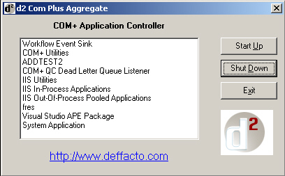



## A COM or COM Plus \[d2 Com Plus Aggregate VBIDE snap in\] example

### Description

This is a VBIDE snap in that gives you an interface to the .dll. It is for controlling Com+, & MTS--MSDTC application start up and shut down from the VBIDE. When developing Com plus applications this really saves a ton of time rather than getting into the Component Services and walking the tree to your object that is causing you to not over write the .dll to create your next version of said object and stopping it (taking it out of memory). I hope this helps you all as you all have helped me!
 
### More Info
 
This only works with NT & Win2k server. Tested with VB6 only. You must have at least service pack 4 installed.

Put the .dll in the add-in folder of VB and enjoy how much faster your COM+ application development becomes! There is a portable .EXE version at the web site in the software area available for at no cost. So if you are going from server to server in the N-Tier environment you can access the Com+ apps quickly to stop the app and restart it.

BHeath

Deffacto Web Designs Team

http://www.deffacto.com

             |
---                |---
**Submitted On**   |2001-05-13 10:49:14
**By**             |[Brian Heath](https://github.com/Planet-Source-Code/PSCIndex/blob/master/ByAuthor/brian-heath.md)
**Level**          |Advanced
**User Rating**    |4.6 (23 globes from 5 users)
**Compatibility**  |VB 6\.0
**Category**       |[OLE/ COM/ DCOM/ Active\-X](https://github.com/Planet-Source-Code/PSCIndex/blob/master/ByCategory/ole-com-dcom-active-x__1-29.md)
**World**          |[Visual Basic](https://github.com/Planet-Source-Code/PSCIndex/blob/master/ByWorld/visual-basic.md)
**Archive File**   |[A COM or C214356202001\.zip](https://github.com/Planet-Source-Code/brian-heath-a-com-or-com-plus-d2-com-plus-aggregate-vbide-snap-in-example__1-23157/archive/master.zip)

